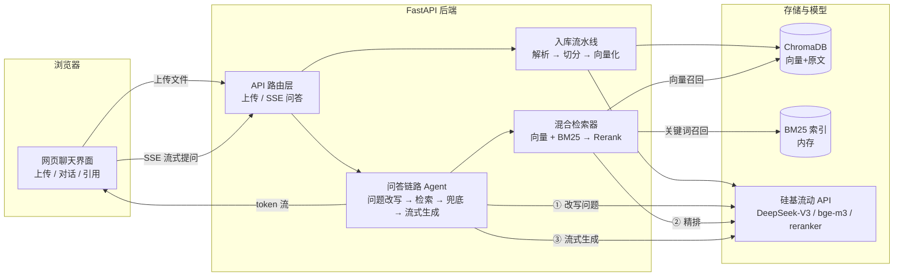

# 企业知识库智能体（Enterprise Knowledge Base Agent）

基于 **RAG（检索增强生成）+ Agent** 架构的企业知识库问答系统：上传企业文档（PDF / Word / Markdown / TXT），即可在网页中用自然语言提问，系统自动检索文档内容、生成带**引用来源**的回答，支持**多轮对话**与**流式输出**。

> 适合作为简历项目 / 课程设计 / 毕业设计，覆盖当前工业界 LLM 应用落地的主流技术栈。

---

## ✨ 功能特性

- 📄 **多格式文档入库**：PDF / DOCX / MD / TXT 上传后自动解析、递归切分、向量化
- 🔀 **混合检索（Hybrid Search）**：向量语义检索（bge-m3）+ BM25 关键词检索（jieba 分词）双路召回
- 🎯 **重排序（Rerank）**：bge-reranker-v2-m3 对候选片段精排，低置信度问题直接兜底、**绝不编造**
- 💬 **多轮对话**：自动把"它的范围？"这类指代词问题改写为独立问题再检索
- 📌 **引用溯源**：回答中的 `[1][2]` 角标可点击，展开查看来源文件名与原文片段
- ⚡ **流式输出**：SSE 逐字推送，打字机效果
- 🗄️ **数据持久化**：ChromaDB 本地落盘，服务重启数据不丢
- 🔐 **密钥安全**：API Key 仅通过 `.env` 配置，不进入代码仓库

## 🧱 技术栈

| 层 | 技术 | 说明 |
|---|---|---|
| Web 框架 | FastAPI + Uvicorn | 异步 REST API、SSE 流式响应 |
| 大模型 | DeepSeek-V3（硅基流动） | 问答生成、问题改写，OpenAI 兼容接口 |
| 向量模型 | BAAI/bge-m3 | 1024 维中英文向量，免费 |
| 重排序 | BAAI/bge-reranker-v2-m3 | 检索结果精排，免费 |
| 向量数据库 | ChromaDB | 本地持久化，无需独立部署 |
| 关键词检索 | rank-bm25 + jieba | BM25 算法 + 中文分词 |
| 文档解析 | pypdf、python-docx | PDF / Word 文本提取 |
| 前端 | 原生 HTML + CSS + JS | 无构建工具，FastAPI 直接托管 |

> 设计取舍：核心 RAG 链路**不依赖 LangChain/LlamaIndex**，全部用 openai SDK + Chroma + BM25 手写实现，代码短、链路透明，方便理解原理和讲解。

## 🏗️ 系统架构



**一次问答的数据流**：

1. 前端把问题 `POST` 到 `/api/chat/stream`；
2. 若该会话有历史，先调大模型把追问**改写**为独立问题（如"它呢？"→"年假有多少天？"）；
3. 问题向量化后并行召回：向量 top20 + BM25 top20，合并去重；
4. 候选片段交 Rerank 模型打分，取 top5；最高分低于阈值（默认 0.3）→ 回复"未找到"，不编造；
5. 把编号片段 `[1]...[5]` 连同问题交给大模型，要求按 `[n]` 标注引用；
6. 回答逐 token 经 SSE 推回前端，来源卡片随流先发。

## 🚀 快速开始

### 1. 获取 API Key（免费）

1. 注册硅基流动账号：<https://cloud.siliconflow.cn>
2. 进入「API 密钥」页面 → 新建密钥 → 复制 `sk-` 开头的字符串
3. bge-m3 向量模型与 bge-reranker 重排序模型免费；DeepSeek-V3 按量计费（每百万 token 几元，演示用量成本极低）

### 2. 配置环境变量

在项目根目录复制配置模板并填入 Key：

```bash
copy .env.example .env      # Windows
# cp .env.example .env      # macOS/Linux
```

编辑 `.env`，把 `sk-在这里替换成你的密钥` 换成你的真实 Key。

### 3. 创建虚拟环境并安装依赖

```bash
# 在项目根目录执行
python -m venv .venv
.venv\Scripts\activate              # Windows
# source .venv/bin/activate         # macOS/Linux

pip install -r requirements.txt -i https://pypi.tuna.tsinghua.edu.cn/simple
```

### 4.（可选）自检 API 连通性

```bash
python scripts/check_api.py
```

三个接口全部 ✅ 即可继续。

### 5. 启动服务

```bash
python -m uvicorn app.main:app --reload
```

浏览器打开 <http://localhost:8000>，上传 `samples/` 目录里的示例文档（或你自己的文档），开始提问。

## 📁 项目结构

```
enterprise-kb-agent/
├── app/
│   ├── main.py              # FastAPI 入口：路由、静态托管、健康检查
│   ├── config.py            # 全局配置（.env 读取）
│   ├── schemas.py           # 请求/响应数据模型
│   ├── services.py          # 组件装配（向量库/检索器/流水线/链路）
│   ├── core/                # 模型层
│   │   ├── llm.py           #   DeepSeek 对话（同步 + 流式）
│   │   ├── embeddings.py    #   bge-m3 向量化
│   │   ├── reranker.py      #   bge-reranker 重排序
│   │   └── prompts.py       #   提示词模板
│   ├── ingestion/           # 入库层
│   │   ├── parsers.py       #   PDF/DOCX/MD/TXT 解析
│   │   ├── splitter.py      #   递归切分器（段落→句子→字符）
│   │   └── pipeline.py      #   上传→解析→切分→入库流水线
│   ├── retrieval/           # 检索层
│   │   ├── vector_store.py  #   ChromaDB 封装
│   │   ├── bm25_store.py    #   BM25 + jieba 索引
│   │   └── retriever.py     #   混合检索编排
│   ├── agent/               # 智能体层
│   │   ├── memory.py        #   会话记忆
│   │   └── chain.py         #   问答主链路（事件流）
│   ├── api/                 # 路由：文档管理 / SSE 问答
│   └── web/                 # 前端页面（index.html / style.css / app.js）
├── scripts/check_api.py     # API 连通性自检
├── samples/                 # 示例文档（考勤制度、产品 FAQ）
├── data/                    # 运行时生成：上传原件 + Chroma 数据（已 gitignore）
├── requirements.txt
└── .env.example
```

## 📖 核心原理（面试讲解要点）

**Q：为什么需要 RAG？直接问大模型不行吗？**
大模型不知道企业内部资料，且会"一本正经地编造"（幻觉）。RAG 先从文档库**检索**相关片段，再让模型**基于片段回答**，把生成锚定在真实资料上。

**Q：为什么切分文档？为什么要重叠？**
模型有上下文长度限制，且片段越短检索越精准。相邻片段保留 50 字重叠，防止关键信息正好被切在边界处。

**Q：为什么向量检索 + BM25 都要？**
向量检索擅长语义匹配（"放假"≈"年假"），但对专有名词、型号、数字不敏感；BM25 擅长精确关键词匹配。两者互补，融合后再由 Rerank 精排，是工业界 RAG 召回的标准做法。

**Q：Rerank 和向量检索有什么区别？**
向量检索用"问题向量 vs 片段向量"的双塔相似度，速度快但偏粗；Rerank 把问题和片段**成对**送进交叉编码器，精度更高但更慢——所以先用便宜的方式召回 20~40 条，再用 Rerank 精排取 5 条。

**Q：多轮对话怎么处理指代词？**
每轮提问前，先让模型结合对话历史把问题改写为独立问题（"它的适用范围？"→"陪产假的适用范围？"），用改写后的问题去检索，避免指代丢失。

**Q：怎么防止幻觉？**
三重保障：① Prompt 强制"只能依据资料、资料不足明说"；② Rerank 最高分低于阈值直接兜底，不调用生成；③ 每条回答标注引用，用户可溯源核对。

## 💼 简历话术参考

> 企业知识库智能体（RAG Agent）｜ Python, FastAPI, ChromaDB, DeepSeek
>
> - 独立设计并实现企业文档问答系统，支持 PDF/Word/Markdown/TXT 解析入库，覆盖文档切分、向量化、混合检索、重排序、流式生成全链路；
> - 实现向量（bge-m3）+ BM25（jieba 分词）双路召回与 bge-reranker 精排的混合检索策略，并通过置信度阈值兜底与引用溯源显著降低幻觉；
> - 基于 FastAPI 构建异步服务，以 SSE 实现逐 token 流式输出，结合会话记忆与问题改写支持多轮追问；
> - 采用分层架构（模型层/入库层/检索层/智能体层/接口层），ChromaDB 持久化存储，配置与密钥分离，含 API 自检脚本与示例文档。

## ❓ 常见问题

| 问题 | 排查 |
|---|---|
| 启动报"未配置 SILICONFLOW_API_KEY" | 复制 `.env.example` 为 `.env` 并填入 Key |
| `check_api.py` 报 401/认证失败 | Key 填错或失效，去硅基流动控制台重新生成 |
| 报模型不存在 | 平台模型 ID 调整，在 `.env` 中改 `LLM_MODEL` / `EMBEDDING_MODEL` / `RERANK_MODEL` |
| 端口 8000 被占用 | 启动时加 `--port 8001` |
| 上传 PDF 提示提取不到文本 | 扫描件/图片版 PDF 需要 OCR，本项目暂不支持 |
| pip 安装慢/超时 | 加清华镜像参数 `-i https://pypi.tuna.tsinghua.edu.cn/simple` |
